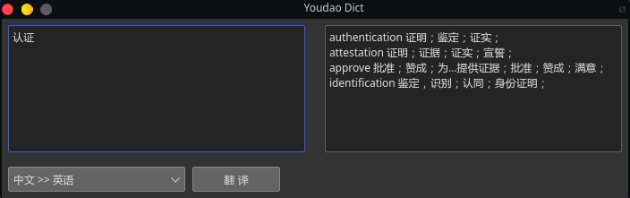
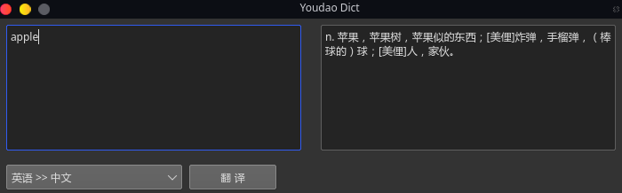

#  Youdao Dict

**Youdao Dict** 是一个使用 `Rust` + `Qt` 开发的防<u>有道词典</u>的**翻译** + **词典** 工具.

此软件所用到的Api为 [有道翻译Api](http://fanyi.youdao.com/?_blank).

## 为什么会有这个项目

我自从电脑切换为Linux环境后, 苦于英语差, 但是又没有找到好用的翻译软件. 便想着自己搞一个, 顺便还可以练习一下 `Rust` .

## Screenshots

