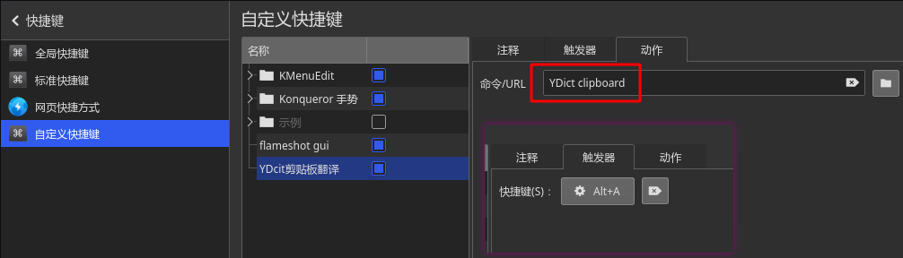
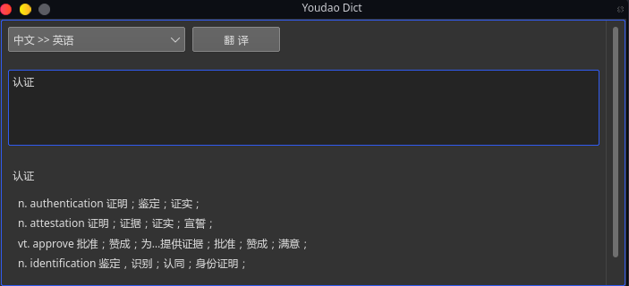
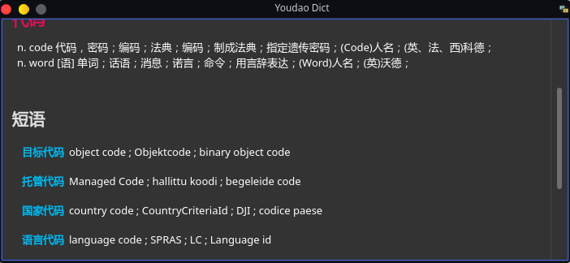
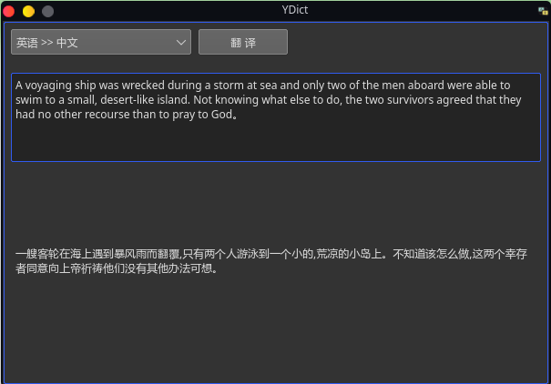
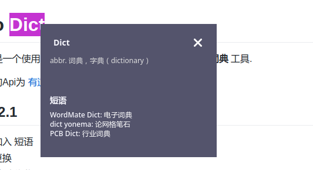
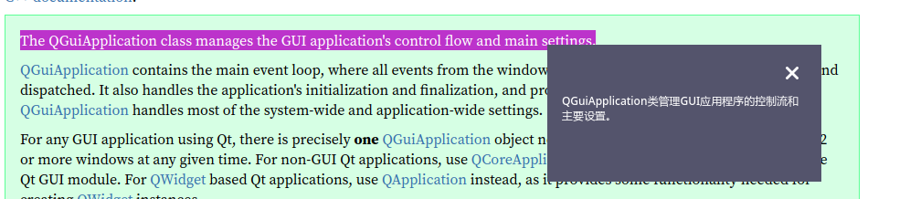

<p align="center">
    <a href="https://www.rust-lang.org" target="_blank">
    
    </a>
    <a href="https://doc.qt.io/" target="_blank">
    
    </a>
    <a href="https://github.com/rust-qt" target="_blank">
    
    </a>
</p>
<p align="center">
    <a href="https://github.com/DreamSaddle/youdao-dict/releases">
    
    </a>
    <a href="https://github.com/DreamSaddle/youdao-dict/commits/master">
    
    </a>
    <a href="https://github.com/DreamSaddle/youdao-dict/issues">
    
    </a>
    <a href="https://github.com/DreamSaddle/youdao-dict/blob/master/LICENSE">
    
    </a>
</p>


# YDict

**YDict** 是一个使用 `Rust` + `Qt` 开发的仿<u>有道词典</u>的**翻译** + **词典** 工具.

此项目所用到的Api为 [有道翻译Api](http://fanyi.youdao.com/?_blank).


## New In 0.3.0

+ 项目更名为 **YDict**
+ 新增**段落**翻译

+ 新增**划词**翻译
+ 添加使用帮助
+ UI稍作调整


## Full Changelog

* [Available Here](CHANGELOG.md)


## Installation Or Upgrade

```shell
# 下载
# 请自行前往Release下载最新版本
wget https://github.com/DreamSaddle/youdao-dict/releases/download/0.3.0/YDict-0.3.0.tar.gz

# 解压
tar -zxvf YDict-0.3.0.tar.gz

# 安装/更新
cd YDict-0.3.0/scripts
sudo chmod +x install.sh
./install.sh

# 执行完成即安装完成
# 可在启动器 工具 类目中查看启动, 或直接终端运行
YDict
```


## Usage

输入框输入待翻译的词汇点击翻译按钮接口完成翻译.

### ShotCut

**Ctrl+U:** 清空输入框内容

**Ctrl+Return(Enter):** 翻译


### 划词翻译

首先安装好**YDict**, 接着你需要在系统中为YDict的划词功能配置一个全局快捷键, 此快捷键测命令为 `YDict clipboard`

例如:




## Development

### Requirements

+ Rust
+ Qt5 or higher


建议开发使用`Linux`桌面环境开发. **此项目也只提供Linux版本Release**.

首先请确保你已经安装好了`Rust`环境以及`Qt5`.

```shell
git clone https://github.com/DreamSaddle/youdao-dict.git
cd youdao-dict
cargo run

# 构建Release
cargo build --release
```


## Screenshots











## 为什么会有这个项目

我自从桌面切换为Linux环境后, 苦于英语差, 但是又没有找到好用的翻译软件. 便想着自己搞一个, 顺便还可以练习一下 `Rust` .

本项目主要用于学习和个人使用, 目前`Rust`资料比较少, `Rust-Qt`资料更是少, 希望此项目能对有兴趣的同学起到一定的帮助作用吧.