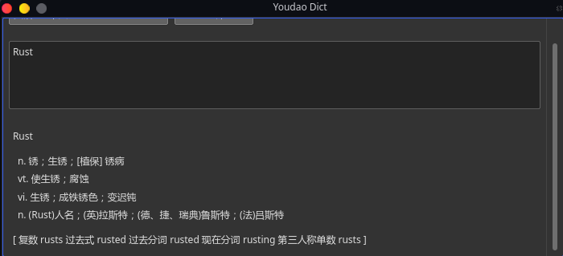

<p align="center">
    <a href="https://www.rust-lang.org" target="_blank">
    
    </a>
    <a href="https://github.com/rust-qt" target="_blank">
    
    </a>
</p>
<p align="center">
    <a href="https://github.com/DreamSaddle/youdao-dict/releases">
    
    </a>
    <a href="https://github.com/DreamSaddle/youdao-dict/commits/master">
    
    </a>
    <a href="https://github.com/DreamSaddle/youdao-dict/issues">
    
    </a>
    <a href="https://github.com/DreamSaddle/youdao-dict/blob/master/LICENSE">
    
    </a>
</p>


#  Youdao Dict

**Youdao Dict** 是一个使用 `Rust` + `Qt` 开发的仿<u>有道词典</u>的**翻译** + **词典** 工具.

此项目所用到的Api为 [有道翻译Api](http://fanyi.youdao.com/?_blank).


## New In 0.2.0

+ UI稍作更新
+ 中英互译基础完成
+ 翻译结果显示更详细
+ 简单的菜单栏及系统托盘图标


## Full Changelog

* [Available Here](CHANGELOG.md)


## Installation

~~在Release中提供了一个 `scripts/install.sh` 的安装脚本, 但不建议使用此脚本安装, 此脚本在`0.1.0`版本~~

**安装方式**

```shell
# 下载
wget https://github.com/DreamSaddle/youdao-dict/releases/download/0.2.0/youdao-dict-0.2.tar.gz

# 解压
tar -zxvf youdao-dict-0.2.tar.gz

# 配置桌面图标文件即可
# 此文件在 release/desktop 中准备了一份, 但需要你自行修改一下 Exec 和 Icon 文件路径
```


# Usage

输入框输入待翻译的词汇点击翻译按钮接口完成翻译.

### ShotCut

**Ctrl+U:** 清空输入框内容

**Ctrl+Return(Enter):** 翻译


# Development

建议开发使用`Linux`桌面环境开发. **此项目也只提供Linux版本Release**.

首先请确保你已经安装好了`Rust`环境.

```shell
git clone https://github.com/DreamSaddle/youdao-dict.git

cargo run

# 构建Release
cargo build --release
```


## Screenshots





## 为什么会有这个项目

我自从桌面切换为Linux环境后, 苦于英语差, 但是又没有找到好用的翻译软件. 便想着自己搞一个, 顺便还可以练习一下 `Rust` .

本项目主要用于学习和个人使用, 目前`Rust`资料比较少, `Rust-Qt`资料更是少, 希望此项目能对有兴趣的同学起到一定的帮助作用吧.